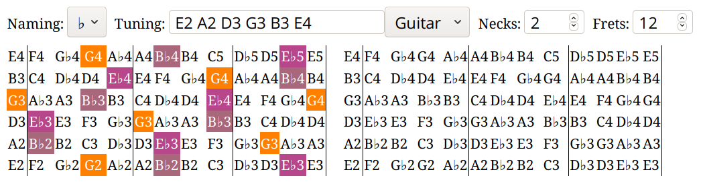

# Overview

This web app can help you choose a fingering for a chord.

# Usage

1. Visit https://orivej.github.io/fretchords/
2. Click on the notes of your chord. For example, this is a E♭ major triad (E♭-G-B♭):

   

   It highlights the frets of the fingerboard with the selected notes — a G3 (G of the small octave) on the open third string, an E♭3 on the first fret of the fourth string, etc. until G4 on the 12th fret of the third string. The leftmost vertical line represents the nut that supports the strings, and the other vertical lines are there to aid counting the frets. The empty fingerboard to the right can be used for another chord.

3. Choose what and where to play. In the case of E♭ some of the options are:

   ```
      E♭/B♭ E♭/G  E♭    E♭   E♭    E♭/B♭ E♭    E♭/B♭ E♭/G
   E|-------3-----3----------6-----6-----------11----11---|
   B|-------4-----4-----8----8-----8-----8-----8-----11---|
   G|-0-----3-----3-----0----8-----8-----8-----8-----12---|
   D|-1-----5-----5-----8----8-----8-----8-----8----------|
   A|-1-----------6-----6----6-----6-----10---------------|
   E|------------------------------6-----11---------------|
   ```

# About colors

The color scheme is based on Scriabin's [Tastiera per Luce](https://en.wikipedia.org/wiki/Clavier_à_lumières). It makes fifth notes (e.g. a tonic and a dominant of a chord) similar in color.
